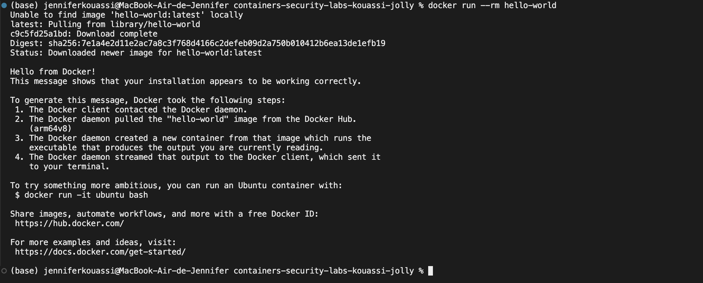
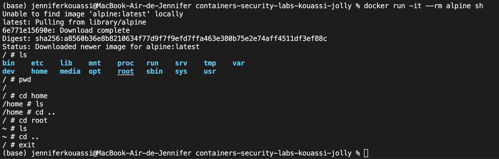

# Session 1 - Report - Introduction to containers and security

### 1. Authors

- Jennifer Kouassi
- Irène Jolly

### 2. Terminology

A Docker container is a standardized, encapsulated environement that runs applications. Docker containers run on any machine or virtual machine where the Docker engine is installed. And they run without knowledge of the underlying system architecture. 

A Docker image is a standardized package that includes all the files, binaries, libraries, and configurations to run a container. 

### 3. Practical Activities 1

#### 3.1. Run a simple container

````bash 
docker run --rm hello-world
````
Look at the logs and understand the steps



#### 3.2. Explore a container in interactif mode

```bash 
docker run -it --rm alpine sh
```


Test the linux commands

#### 3.3. Analyse the systems resources of a container

```bash
docker run -d --name test-container nginx
docker stats test-container
```
Observe the CPU and memory consumption. 

#### 3.4. List the permissions of a container

```
docker run --rm --cap-add=SYS_ADMIN alpine sh -c 'cat /proc/self/status'
```


