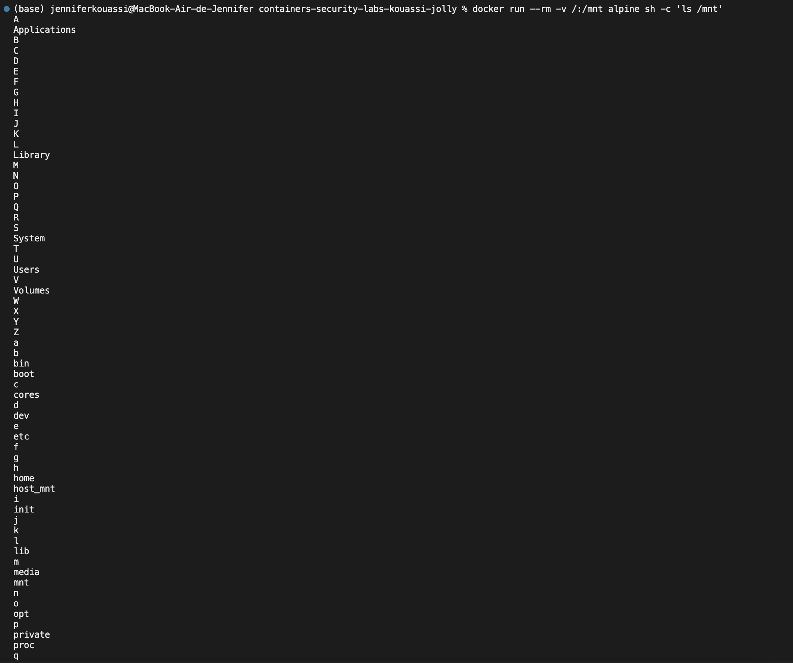

# Session 1 - Report - Introduction to containers and security

### 1. Authors

- Jennifer Kouassi
- Irène Jolly

### 2. Terminology

A Docker container is a standardized, encapsulated environement that runs applications. Docker containers run on any machine or virtual machine where the Docker engine is installed. And they run without knowledge of the underlying system architecture. 

A Docker image is a standardized package that includes all the files, binaries, libraries, and configurations to run a container. 

### 3. Practical Activities 1

#### 3.1. Run a simple container

````bash 
docker run --rm hello-world
````
Look at the logs and understand the steps


The container outputs a message indicating that Docker is successfully installed and that the Docker engine can run containers as expected.

#### 3.2. Explore a container in interactive mode

We started an Alpine Linux container in interactive mode to explore its internal environment. 
```bash 
docker run -it --rm alpine sh
```
Inside the container, we executed basic linux commands such as `ls`, `pwd` to navigate and inspect the container's filesystem. 


Test the linux commands

#### 3.3. Analyse the systems resources of a container
To monitor the system resource consumption of a running container, we deployed an Nginx container in detached mode and used the `docker stats`command. 
```bash
docker run -d --name test-container nginx
docker stats test-container
```


We observed low memory usage and minimal CPU consumption by the container, demonstrating the efficiency of lightweight containers like Nginx. 

#### 3.4. List the permissions of a container
We tested how to assign additional Linux capabilities to a container using the `--cap-add`option. Specifically, we added the `SYS_ADMIN`capability. 
```
docker run --rm --cap-add=SYS_ADMIN alpine sh -c 'cat /proc/self/status'
```


We can see that all the files of the root user are listed, which introduces security risks.

### 4. Practical activities - Threats and Vulnerabilities

#### 4.1. Testing a container with high priviledges
We ran a container in `--privileged` mode to understand the security risks associated with elevated permissions.

```bash 
docker run --rm --privileged alpine sh -c 'echo hello from privileged mode'
```


Lancer un container en mode priviligié est dangereux car ça donne un accés complet au système d'exploitation de l'hôte. Une personne peut depuis le container modifier les paramètres du systèmes ou accéder à des données privés. On peut aussi créer un nouvel utilisateur avec des autorisations élevé et cela facilite les évasions de container en établissant une connexion avec l'extérieur.

#### 4.2. Simulation

```bash 
docker run --rm -v /:/mnt alpine sh -c 'ls /mnt'
```


Cette faille de configuration montre que toutes personne ayant accés au container peut lire n'importe quel fichier sur l'hôte dont les fichiers de configurations ou des mots de passe.

#### 4.3. Create an image

```bash 
FROM alpine
RUN adduser -D appuser
USER appuser
CMD ["echo", "Container sécurisé!"]
```


#### 4.4. Restrict network access

#### 4.5. Block internet connection
```bash
docker network disconnect bridge mon-container
```


#### 4.6. Test internet connection

```bash 
ping google.com 
```


On pouvait ping google lors de la création du container mais une fois l'accés au réseau restreint le ping ne marche plus ce aaui montre que l'accés à Internet à bien été bloquer.

#### 4.7. Download and scan an image 
```bash
docker pull vulnerables/web-dvwa
trivy image vulnerables/web-dvwa
```

```bash
trivy image --format json --output resultat-trivy.json vulnerables/web-dvwa
```


#### 4.8. Scan an image to detect the vulnerabilities

```bash
grype alpine:latest
```


