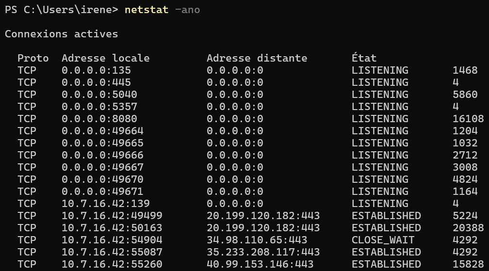
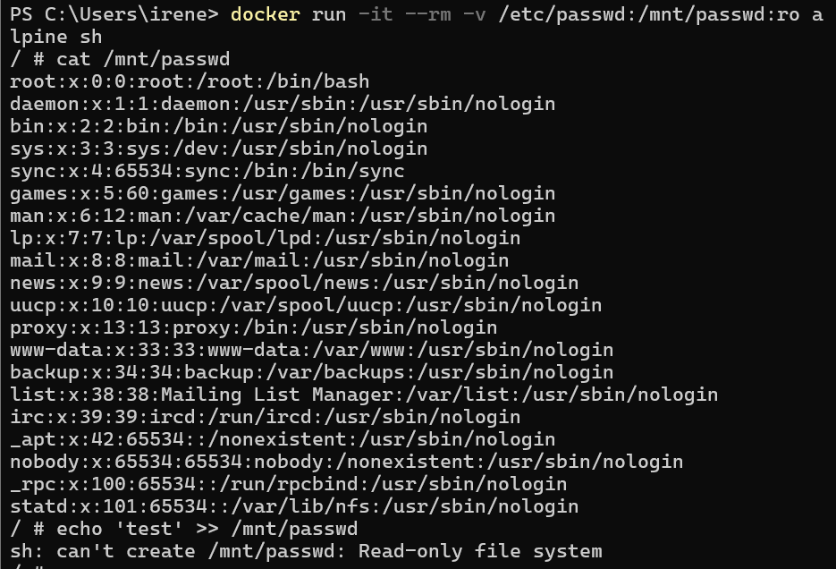
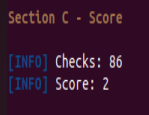

# Session 2 - Report - Bonnes pratiques pour sécuriser les containers

### 1. Authors

- Jennifer Kouassi
- Irène Jolly

### 3. Practical Activities

#### 3.1 Éviter l’Exposition Involontaire de Ports

#### 3.2 Restreindre les permissions d’accès aux fichiers sensibles

#### 3.3 Auditer la configuration d’un container avec Docker Bench

#### 3.4 Stocker et Utiliser des Secrets

#### 3.5 Trouver la clé Contexte
